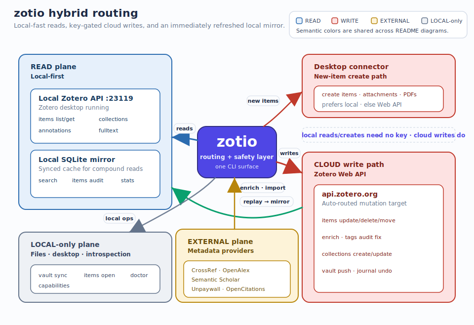
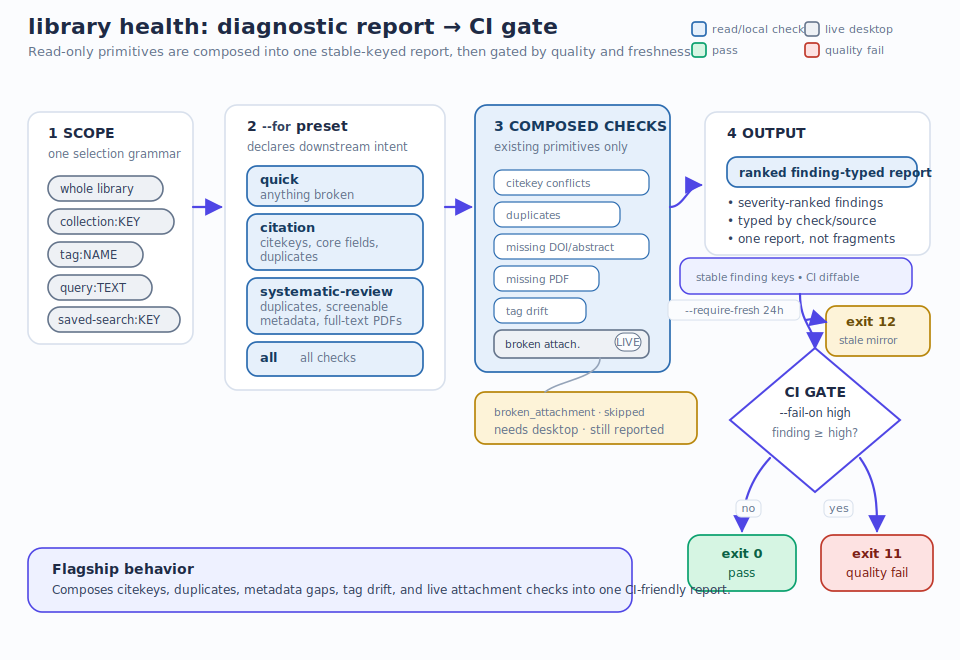
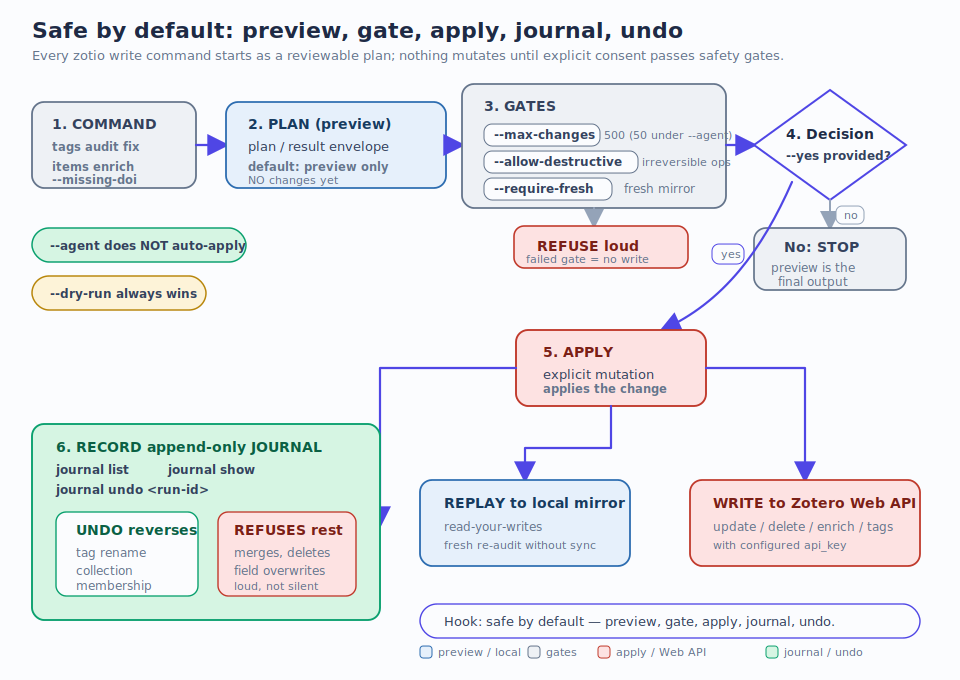
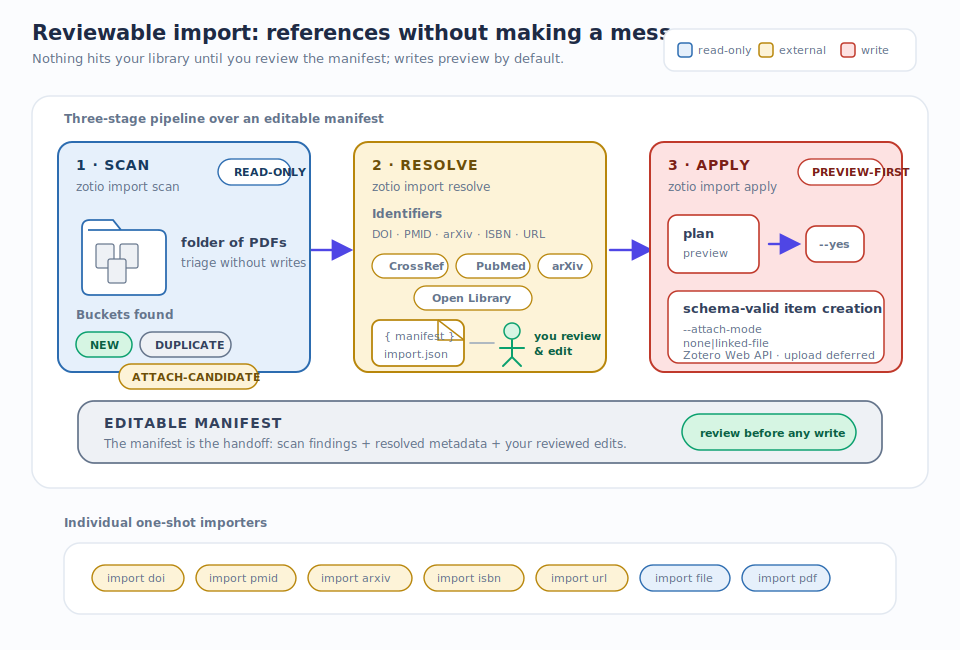
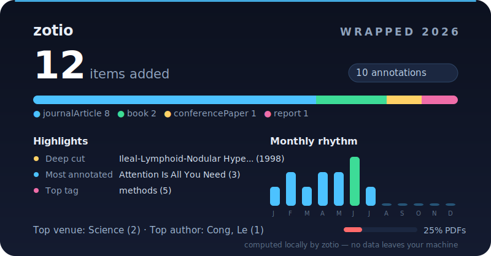

<p align="center">
  <picture>
    <source media="(prefers-color-scheme: dark)" srcset="docs/assets/logo-wordmark-dark.svg">
    <source media="(prefers-color-scheme: light)" srcset="docs/assets/logo-wordmark.svg">
    
  </picture>
</p>

<p align="center">
  <strong>
    The trust-and-automation layer for
    <a href="https://www.zotero.org/">Zotero</a>
  </strong>
</p>

<p align="center">
  <a href="https://github.com/OrgMentem/zotio/actions/workflows/ci.yml"></a>
  <a href="https://github.com/OrgMentem/zotio/actions/workflows/docs.yml"></a>
  <a href="https://go.dev/"></a>
  <a href="https://orgmentem.github.io/zotio/guide/ci/"></a>
  <a href="LICENSE"></a>
</p>

<p align="center">
  <a href="https://orgmentem.github.io/zotio/"><strong>Home</strong></a>
  &middot;
  <a href="https://orgmentem.github.io/zotio/guide/install/"><strong>Get started</strong></a>
  &middot;
  <a href="https://orgmentem.github.io/zotio/reference/commands/"><strong>Commands</strong></a>
  &middot;
  <a href="https://orgmentem.github.io/zotio/guide/mcp-server/"><strong>MCP server</strong></a>
  &middot;
  <a href="https://orgmentem.github.io/zotio/guide/agent-skill/"><strong>Agent skill</strong></a>
</p>

<p align="center">
  Local-fast reads, preview-first writes, and bounded, provenance-tagged context
  — for you, your scripts, and your AI agents. <code>zotio</code> reads straight
  from your running Zotero desktop app (no API key), mirrors your library to
  local SQLite for offline search and analytics, and routes every change through
  a preview-first safety envelope so nothing mutates your library by accident.
</p>

```bash
brew install orgmentem/tap/zotio                      # or grab a signed binary from Releases
zotio init                                            # guided setup: detect Zotero, key, first sync, health check
zotio library health --for citation --fail-on high   # is this library fit to cite? (exit 11 if not)
zotio items retract-check                             # are you citing retracted papers?
zotio items bibcheck thesis.tex --fail-on-unknown     # does every \cite{} resolve to your library?
zotio search 'automation trust' --data-source local  # offline full-text search
zotio items enrich --missing-doi --dry-run            # resolve DOIs from CrossRef/OpenAlex — preview only
```

**No Zotero yet? Try the sandbox** — a bundled sample library (34 classic papers, one genuinely retracted) that needs no desktop app and no API key:

```bash
zotio demo          # seed the sandbox + print a tour
ZOTIO_DEMO=1 zotio library health --for citation
```

---

## Why zotio

Zotero's GUI is great for reading and citing. It is painful the moment you need to *operate* on a library at scale: find every article missing a PDF, catch duplicate `\cite{}` keys before a submission, export a week of highlights, keep an Obsidian vault in sync, or hand an AI agent trustworthy context. Existing CLIs and `pyzotero` give you raw API access — then you write the glue, and you own the risk.

`zotio` is the glue, hardened:

- **Reads are local and free.** Point at your running desktop app — no API key, no cloud round-trip, works offline against a synced mirror.
- **Writes are preview-first.** Every mutation shows a plan before it touches anything. Gates cap blast radius; irreversible ops require an explicit opt-in; an append-only journal lets you undo the reversible ones.
- **Context is bounded and provenance-tagged.** Every result says where it came from and how fresh it is — so a human or an agent knows whether to trust it. `zotio` **never calls an LLM**; it does the assembly and budgeting a model is bad at, then hands off.

It is not "every Zotero endpoint in a terminal." It is the tool you reach for when the GUI gets too manual: **find the problems that bite downstream, fix them safely, ingest with review, and give agents a surface they can trust.**

---

## How it works

Reads stay on your machine. Writes split by intent: **creating a new item (with its attachments/PDFs) prefers the local desktop connector** (`localhost:23119`, no key — the same channel the browser "Save to Zotero" button uses), while **everything else — field edits, deletes, enrichment, tag ops, moves, and `collections` create/update — routes to the Zotero Web API** and needs a configured key. The connector path is a *preference, not a guarantee*: `--via auto` uses it only on a personal library with the desktop running, and falls back to the Web API otherwise (group libraries always go to the cloud). Either way it's preview-first, the version-read happens locally, and the applied change is replayed into your local mirror so a follow-up read sees it without another sync.



| Plane | Backend | Needs a key? |
|---|---|---|
| **Read** | Local Zotero API (`localhost:23119`) + synced SQLite mirror | No |
| **Write — new item** | Local desktop connector (`localhost:23119`) when personal + desktop up; else Web API. New items, attachments, PDFs. | No (connector path) |
| **Write — everything else** | Zotero Web API (`api.zotero.org`) — edits, deletes, enrich, tags, moves, `collections` create/update | Yes — configured once |
| **External** | CrossRef · OpenAlex · Semantic Scholar · Unpaywall · OpenCitations | No (feeds enrich/import) |
| **Local-only** | Files, desktop launch, vault, introspection | No |

Run `zotio doctor` any time to see connectivity, cache freshness, and a `writes:` line telling you whether write-back is available or read-only.

---

## The flagship: `library health`

One command that answers a real question — *"is this library fit for the next thing I'm going to do with it?"* — instead of making you run six separate audits and eyeball the output.



`library health` composes the checks that already exist (citekey conflicts, duplicates, missing metadata, tag drift, broken attachments) into **one ranked, finding-typed report**. You pick what "ready" means with `--for`:

| `--for` | Prepares for | Checks |
|---|---|---|
| `quick` *(default)* | anything obviously broken | citekey conflicts, duplicates, broken attachments |
| `citation` | a manuscript bibliography | missing/duplicate citekeys, citation-core fields, duplicates |
| `systematic-review` | a PRISMA screening corpus | duplicates, screenable metadata (title/abstract), full-text PDFs |
| `all` | a full sweep | every registered check |

```console
$ zotio library health --for quick
Health: needs attention
Scope: library · 846 items · source local · synced 1d ago · preset quick

High (13)
  [duplicate_candidates] doi="10.1002/bdm.2118" (2 items)
  [duplicate_candidates] title="Social psychology" (3 items)
  ... 11 more

Skipped (precondition unmet)
  broken_attachment_file — live check (needs Zotero desktop running); off by default.
    Fix: zotio library health --for quick --verify-files

Remediation plan (preview-first)
  duplicate_candidates — zotio items duplicates resolve --doi (preview first; add --yes after review)
```

Three things make it trustworthy, not just convenient:

- **It gates CI.** `--fail-on critical|high|any` exits **`11`** when the bar isn't met — drop it in a pre-submission hook. `--require-fresh 24h` exits **`12`** if your local mirror is stale.
- **It never lies by omission.** A check that needs the desktop app (broken attachments) doesn't silently vanish — it becomes a **loud skip with a remedy**, and if that skip is gate-relevant the run exits **`9`** (setup required) rather than falsely passing.
- **It points at the real fixer.** Findings carry a `recommended_action` naming the exact existing command (`items enrich`, `items duplicates resolve`, `tags audit fix`) — health *diagnoses*, dedicated commands *treat*.

### CI for your bibliography

`--badge` renders any health run as a [shields.io endpoint](https://shields.io/badges/endpoint-badge) JSON artifact — `healthy` green, findings yellow, gate-failure red, `setup required` orange:

```yaml
# .github/workflows/bibliography.yml (excerpt)
- run: zotio sync
- run: zotio library health --for citation --fail-on high --badge > badge.json
  # exit 11 fails the job when the bar isn't met; badge.json says why
# publish badge.json anywhere shields can reach (gh-pages, gist, artifact host), then:
#   https://img.shields.io/endpoint?url=https://<you>.github.io/<repo>/badge.json
```

Your thesis or review repo gets a live `bibliography | healthy` badge — and a failing build the moment a citekey conflict or duplicate slips in. Add `--check-retractions` to extend the gate to **retracted papers** (Crossref's Retraction Watch data), and gate the manuscript itself with `zotio items bibcheck paper.tex --fail-on-unknown`. The [zotio-action](https://github.com/marketplace/actions/zotio-bibliography-health-for-zotero) packages this — install, sync, gate, and diff against a baseline so it fails only on *new* problems ([guide](https://orgmentem.github.io/zotio/guide/ci/)).

---

## Safe by default: the write engine

Every write command — `items enrich`, `tags audit fix`, `items duplicates resolve`, `items preprint-check fix`, `items create/update/move/delete`, `import apply`, `vault push` — flows through one mutation envelope with identical, predictable semantics.



- **Preview is the default.** You get a plan/result envelope with zero changes. `--yes` applies; `--dry-run` always wins.
- **`--agent` does *not* auto-apply.** Agent mode sets JSON + non-interactive defaults, but a write still needs an explicit `--yes`.
- **Gates cap the blast radius.** `--max-changes` defaults to 500 (50 under `--agent`); irreversible ops (merge, permanent delete, empty-trash) refuse to run without `--allow-destructive`.
- **Read-your-writes.** An applied write is replayed into the local mirror immediately, and the post-write item state comes back in the envelope — a re-audit sees the fix with no follow-up `sync`.
- **Journaled + reversible.** Every applied run is recorded append-only (`journal list` / `journal show`). `journal undo <run-id>` reverses the reversible ops (tag renames, collection membership) and **loudly refuses** the rest (merges, deletions, field overwrites) rather than guessing.

---

## Import without making a mess

Bulk-import references through a review checkpoint. Nothing hits your library until you've seen — and can edit — the manifest.



```bash
zotio import scan ~/Downloads/papers          # read-only: triage new vs duplicate vs attach-candidate
zotio import resolve ~/Downloads/papers -o manifest.json   # resolve DOI/PMID/arXiv/ISBN → editable manifest
#   ... review and edit manifest.json ...
zotio import apply manifest.json --dry-run     # preview the writes
zotio import apply manifest.json --yes         # schema-valid creation via the Web API
```

- **Scan** classifies a folder of PDFs against your existing library — extracting DOIs from filenames or the PDF bytes — so you never re-import what you already have.
- **Resolve** turns findings into an editable JSON manifest, enriching create-entries from CrossRef. This is the human touchpoint.
- **Apply** creates schema-valid items, preview-first, with an explicit `--attach-mode none|linked-file` contract (stored-file upload is deferred, and says so).

One-shot importers are there too: `import doi|pmid|arxiv|isbn|url|file|pdf`.

---

## Conflict-safe vault round-trip

Keep an Obsidian or Logseq vault in step with Zotero **in both directions** — without ever clobbering your prose.


```bash
zotio vault sync              # Zotero → one Markdown note per item (idempotent)
zotio vault push --dry-run    # your ## Notes region → a managed Zotero child note
zotio vault pull --dry-run    # remote note edits → your ## Notes region (fast-forward only)
```

Each note has a **managed region** (frontmatter + a fenced annotations block, refreshed on every sync) and **your region** (`## Notes`, prose preserved untouched). Write-back is fast-forward only: if both sides changed, `zotio` never merges blindly — it writes a **reviewable conflict artifact** under `_vault-zotero-conflicts/` and reports it, so divergence becomes something you resolve on purpose (`vault resolve --keep-vault | --keep-remote | --recreate`), never a silent overwrite. Run `vault audit` for a read-only preflight before any push.

Configure the vault once in `~/.config/zotio/config.toml`:

```toml
[vault]
root = "~/Vaults/dev"    # ~ is expanded; base output dir
notes_dir = "Zotero"     # notes land in <root>/<notes_dir>
format = "obsidian"      # or "logseq"
```

---

## More that the GUI and `pyzotero` don't give you

### Library hygiene, integrity & analytics


<p align="center">
  
</p>

- **`items retract-check`** — check every DOI against **Crossref's Retraction Watch data**: retractions, expressions of concern, and corrections, with notice DOIs and dates. Opt into the `library health` gate with `--check-retractions`. *(This one reads the network.)*
- **`collections gaps`** — citation-graph gap analysis: rank the papers your collection cites most that are **missing from your library** (OpenCitations + Semantic Scholar), then `import doi` them. *(Network too.)*
- **`items bibcheck <manuscript>`** — parse `\cite{}`/`@citekey` from `.tex` or pandoc Markdown and resolve every key against your library — unknown and ambiguous keys flagged, `--fail-on-unknown` exits 11 for CI.
- **`tags audit`** — group tags that differ only by case or variant, with item counts and **ready-to-run merge commands**. On a real 840-tag library it surfaced 53 duplicate groups in one pass.
- **`library stats`** — a one-command dashboard: items by type and year, top venues, PDF coverage (e.g. *684/792 (86%)*).
- **`items audit`** — count and list items missing PDFs, abstracts, DOIs, tags, or citation-core fields; `--verify-files` checks PDFs actually exist on disk.
- **`items duplicates`** — detect likely duplicates by DOI or title (attachments/notes excluded), then `duplicates resolve` to merge safely.
- **`items citekey-conflicts`** — find missing or duplicate Better BibTeX keys before they break a LaTeX build.
- **`items venues` · `items authors` · `items stale` · `items unfiled` · `items missing-pdf`** — slice your library by publication, creator, staleness, filing, and PDF gaps.

### Reading & synthesis

- **`items summarize`** — assemble a bounded, synthesis-ready bundle for an item or collection (citation + abstract + your annotations + a capped fulltext excerpt + known metadata gaps + a synthesis prompt) and hand it to any LLM. `zotio` does the budgeting; it never calls the model.
- **`annotations export` · `annotations timeline` · `annotations search`** — pull highlights and notes as Markdown or JSON, ordered by date or searched by text.
- **`reading-list`** — a `to-read` tag queue with an `add` → `start` → `done` lifecycle for triaging what to read next.
- **`items note-template`** — generate a pre-filled Obsidian/Logseq reading note for an item.
- **`items open`** — print or launch a `zotero://` deep link to an item, collection, or PDF (cross-platform).
- **`library wrapped`** — your Zotero year in review: items by month and type, top venues and authors, annotation activity, PDF coverage — with a shareable SVG card:

<p align="center">
  
</p>

### Enrichment (reads external APIs, writes Zotero)

- **`items enrich`** — fill missing DOIs and abstracts from **CrossRef → OpenAlex → Semantic Scholar**, attach open-access PDF links from **Unpaywall**, and record provenance in each item's Extra field. `--validate` runs a read-only DOI discrepancy report against CrossRef and OpenCitations.
- **`items preprint-check`** — find arXiv preprints that now have a published CrossRef record; `preprint-check fix` upgrades them with the journal DOI — preview-first, journaled, and it never overwrites a conflicting DOI.

### Export & reproducibility

- **`collections export`** — a whole collection and its subcollections as one BibTeX or CSL-JSON file, structure preserved in comments.
- **`export snapshot`** — a reproducible, resumable, fully paginated JSONL export with a `<output>.lock.json` content lockfile (sorted key+version + sha256) for drift detection and clean review handoffs.

### Freshness & schema

- **`sync` · `watch` · `tail`** — populate the mirror, keep it fresh with periodic incremental syncs, or stream live changes. `watch --health` diffs `library health` between cycles and reports **new findings** to stdout or a webhook — hear about drift the cycle it appears.
- **`schema drift`** — after a Zotero upgrade, detect item-type / field / creator-field changes against a saved baseline.

---

## Built for agents

`zotio` publishes a machine-readable trust model so an MCP host, CI job, or shell script can discover what's safe, fresh, and writable *before* it acts.

- **`--agent`** on any command: JSON + compact + non-interactive + no color, in one flag. (It never auto-applies writes.)
- **`capabilities`** — the full registry (122 commands), each tagged with `operation`, `data_sources`, `write_target`, `destructive`, and `requires` preconditions.
- **`agent-context`** — a structured description of the whole CLI, embedding the registry and discovery hints.
- **`which "<capability in your words>"`** — resolve a natural-language query to the command that does it.
- **Stable envelopes** — one mutation plan/result shape, one finding shape, one exit-code contract. Learn the grammar once.

**Scope grammar** — one selection vocabulary across reads, audits, exports, and enrich:

```
collection:KEY   tag:NAME   query:TEXT   item:KEY   saved-search:KEY (needs live desktop)
```

**Exit codes:** `0` ok · `2` usage · `3` not-found · `4` auth · `5` API · `7` rate-limited · `9` precondition/setup · `10` config · `11` quality-gate failed · `12` freshness-gate failed.

---

## Install

`zotio` comes in three pieces you can install independently: the **CLI** (the engine — everything runs through it), the **agent skill** (drives the CLI inside coding agents), and the **MCP server** (exposes the CLI to MCP hosts like Claude Desktop). Most people want the CLI; add the skill or MCP server for your agent of choice.

### 1. The CLI — `zotio`

**Homebrew (macOS / Linux):**

```bash
brew install orgmentem/tap/zotio
```

This installs both `zotio` and the `zotio-mcp` MCP server; `brew upgrade` tracks new releases.

**Prebuilt binaries:** every [GitHub release](https://github.com/OrgMentem/zotio/releases) ships archives for macOS, Linux, and Windows (amd64/arm64) with cosign-signed checksums and SBOMs. Unpack and put `zotio` on your `PATH`; on macOS clear the Gatekeeper quarantine (`xattr -d com.apple.quarantine zotio`), on Unix `chmod +x zotio`.

**From source:**

```bash
git clone https://github.com/OrgMentem/zotio && cd zotio && go build -o zotio ./cmd/zotio
```

Then let the CLI walk you through setup — Zotero detection, the local-API toggle, an optional Web API key, first sync, and a health check:

```bash
zotio init
```

### 2. The agent skill

A focused skill — bundled in this repo as [`SKILL.md`](SKILL.md) — that teaches a coding agent to drive the CLI directly (the most efficient path; no MCP server in the middle).

**Recommended — the [`skills` CLI](https://skills.sh)** (works across Claude Code, Cursor, Codex, Cline, opencode, and 40+ agents):

```bash
npx skills add OrgMentem/zotio          # detect your agents and install
npx skills add OrgMentem/zotio --list   # preview without installing
npx skills add OrgMentem/zotio -g       # install globally (all projects)
```

**Manual:**

- **Claude Code:** copy `SKILL.md` into `~/.claude/skills/zotio/SKILL.md` (or your project's `.claude/skills/zotio/`).
- **Any other agent:** point it at the raw file — `https://raw.githubusercontent.com/OrgMentem/zotio/main/SKILL.md` — or paste it into your agent's skill store.

### 3. The MCP server — `zotio-mcp`

`zotio-mcp` ships alongside the CLI — the Homebrew formula and every release archive include both binaries. Register it:

```bash
# Claude Code
claude mcp add zotero zotio-mcp -e ZOTERO_API_KEY=<your-key>
```

For Claude Desktop, every [release](https://github.com/OrgMentem/zotio/releases) ships per-platform [MCPB](https://github.com/modelcontextprotocol/mcpb) bundles — download the `.mcpb` for your platform, double-click it, and Claude Desktop walks you through the install.

<details>
<summary>Claude Desktop manual JSON config (advanced)</summary>

Install the `zotio-mcp` binary and add to `~/Library/Application Support/Claude/claude_desktop_config.json`:

```json
{
  "mcpServers": {
    "zotero": {
      "command": "zotio-mcp",
      "env": { "ZOTERO_API_KEY": "<your-key>" }
    }
  }
}
```

</details>

The `ZOTERO_API_KEY` is optional for read-only local-desktop use (the local API needs no key); set it to enable writes and reach group libraries.

---

## Authentication

**Reads** go to your Zotero desktop app at `localhost:23119` — no API key required while Zotero is running. First enable the local API in Zotero: **Settings → Advanced → "Allow other applications to communicate with Zotero."**

**Creating** items and saving attachments also works keyless — those go through the same local desktop connector.

**Editing writes** (`items update`/`delete`/`move`, `items enrich`, `tags` mutations, `vault push`/`pull`/`resolve`, most of `import apply`) route to the Zotero Web API and need a key. Configure it once:

```bash
zotio auth set-token <key>     # or set ZOTERO_API_KEY
```

Generate a key at <https://www.zotero.org/settings/keys>. The first Web API write prints a one-time stderr notice naming the target. A key is also needed to read **group libraries** or to read while the desktop app is **closed**. Run `zotio doctor` to see a `writes:` line reporting whether write-back is available.

---

## Use

### Use the CLI directly

```bash
# 1. Verify Zotero is running and reachable
zotio doctor

# 2. Sync your library to local SQLite for offline search + analytics
zotio sync

# 3. See the shape of your library
zotio library stats

# 4. Certify it for a citation handoff (exit 11 if it fails the bar)
zotio library health --for citation --fail-on high

# 5. Search offline
zotio search 'automation trust' --data-source local --json

# 6. Export a week of highlights for synthesis
zotio annotations timeline --since 2026-05-01 --format markdown > this-week.md
```

### Use the skill in a coding agent

Once installed (above), invoke `/zotio <query>` in Claude Code. The skill drives the CLI directly — the most efficient path, no MCP server in the middle.

### Use the MCP server in an agent host

Once registered (above), the MCP server exposes a **command-orchestration facade** (`command_search` / `command_run`) rather than one tool per endpoint — agents discover and drive the CLI the same way a human would (see [`notes/adr/0001-mcp-command-surface.md`](notes/adr/0001-mcp-command-surface.md); switch surfaces via `ZOTIO_MCP_SURFACE`). It also serves Zotero context as **resources** — `zotero://context`, `zotero://agent-context`, `zotero://status`, `zotero://schema`, `zotero://freshness`, `zotero://health/{scope}`, `zotero://capabilities`, and bounded graph resources (`collections/{key}/tree`, `items/{key}/children|attachments|context`) — plus guided **prompts** (prepare-library-health, prepare-import, sync-vault-safely).

---

## Output formats

```bash
zotio collections list                       # human table (JSON when piped)
zotio collections list --json                # JSON for scripting and agents
zotio collections list --json --select id,name,status   # only the fields you need
zotio collections list --dry-run             # show the request without sending
zotio collections list --agent               # JSON + compact + non-interactive + no color
```

Also available: `--csv`, `--plain`, `--quiet`, `--compact`, and `--deliver stdout|file:<path>|webhook:<url>`.

---

## Health check & troubleshooting

```bash
zotio doctor            # config, credentials, connectivity, cache freshness, writability
```

- **`doctor: connection refused`** — open Zotero desktop and enable **Settings → Advanced → "Allow other applications to communicate with Zotero."**
- **`items missing-pdf` / analytics return nothing** — run `zotio sync` first to populate the local mirror.
- **`annotations export` outputs empty sections** — PDF annotations must be made in Zotero's built-in PDF reader, not an external app.
- **`citekey-conflicts` finds no keys** — install the Better BibTeX extension; citation keys live in the `extra` field.
- **Authentication errors (exit 4)** — `zotio doctor` to check credentials; verify `echo $ZOTERO_API_KEY`.

---

## Configuration

Config file: `~/.config/zotio/config.toml`. Static request headers can be set under `[headers]`; per-command overrides take precedence.

| Variable | Required | Description |
|---|---|---|
| `ZOTERO_API_KEY` | No for reads | Required for writes (routed to the Zotero Web API), group libraries, and access while the desktop app is closed. Local desktop reads need no key. Configure once via `zotio auth set-token <key>`. |

---

## Command reference

Run `zotio --help` for the full command list, or `zotio <command> --help` for any subcommand. Ask the CLI directly when you know the goal but not the command:

```bash
zotio which "export bibtex for a collection"
```

<details>
<summary>Top-level commands</summary>

`agent-context` · `analytics` · `annotations` · `auth` · `capabilities` · `collections` · `doctor` · `export` · `groups` · `import` · `init` · `items` · `journal` · `library` · `profile` · `reading-list` · `schema` · `search` · `searches` · `sync` · `tags` · `tail` · `vault` · `version` · `watch` · `which` · `workflow`

</details>

---

## Sources & inspiration

Built by studying these projects and resources:

- [**cli-anything-zotero**](https://github.com/PiaoyangGuohai1/cli-anything-zotero) — TypeScript
- [**54yyyu/zotero-mcp**](https://github.com/54yyyu/zotero-mcp) — Python
- [**pyzotero**](https://github.com/urschrei/pyzotero) — Python
- [**kujenba/zotero-mcp**](https://github.com/kujenba/zotero-mcp) — Python
- [**jbaiter/zotero-cli**](https://github.com/jbaiter/zotero-cli) — Python
- [**dhondta/zotero-cli**](https://github.com/dhondta/zotero-cli) — Python

---

Licensed under MIT. Bootstrapped with [CLI Printing Press](https://github.com/mvanhorn/cli-printing-press); substantially hand-written and independently developed since.

Zotero is a registered trademark of the [Corporation for Digital Scholarship](https://digitalscholar.org/). zotio is an independent project and is not affiliated with or endorsed by Zotero or the Corporation for Digital Scholarship.
