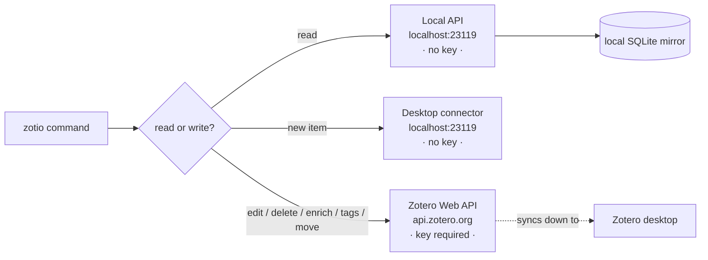

# Zotero API behavior

`zotio` talks to Zotero over its **local HTTP API** (`http://localhost:23119/api`) — the same native API the desktop app exposes, not Better BibTeX's JSON-RPC. That choice is what makes the CLI durable across Zotero major versions, but it comes with a few behaviors worth understanding.

## Two backends, split by intent



- **Reads** are served locally and are **keyless**. `zotio` also keeps a synced SQLite mirror so reads can run offline — see [Local read parity](local-read-parity.md).
- **New items** (with attachments/PDFs) prefer the keyless local desktop connector.
- **Everything else that writes** — field edits, deletes, enrichment, tag ops, collection changes, note write-back — routes to the Zotero **Web API** and needs a key. See [Authentication](../guide/authentication.md).

## The local API is GET-only

Zotero's local API currently serves reads only; writes are "coming" but not shipped. `zotio` handles this transparently:

- With a Web API key configured, mutating commands **auto-route** their writes to `api.zotero.org` (reads stay local). A one-time notice on stderr names the target. Web API writes sync back down to your desktop.
- With **no** key, a write hits the read-only local API and `zotio` prints read-only guidance instead of a misleading auth error.

!!! tip "Check writability"
    `zotio doctor` reports a `writes:` line — whether write-back is available (key present) or read-only.

!!! warning "Version conflicts"
    Because reads are local and writes go to the cloud, a stale local version can lose a race and return `412`. `zotio` maps that to a clear "version conflict — run `sync`" hint. Run `zotio sync` and retry.

## Enable the local API

Reads and keyless item creation require the local API to be turned on once:

**Zotero → Settings → Advanced → "Allow other applications on this computer to communicate with Zotero."**

Without it, requests return `403`.

## Schema endpoints are global

Item-type and field schema endpoints (`itemTypes`, `itemFields`, …) are served globally, not under your library. `zotio`'s `schema` commands and `schema drift` handle the routing for you — you don't need to think about it. After a Zotero upgrade, run:

```bash
zotio schema drift        # detect new/removed item types & fields
```

## Keeping up with Zotero releases

Zotero now ships every 6–10 weeks. New releases almost always add *fields and data* rather than endpoints, so `schema drift` is the tool to catch what changed. The Web API v3 surface is stable and versioned; the local API is the evolving one.

!!! note "For maintainers"
    The full endpoint coverage matrix, known gaps, and the refresh procedure to re-run after a Zotero upgrade live in the repo at `notes/zotero-api-coverage.md`.
