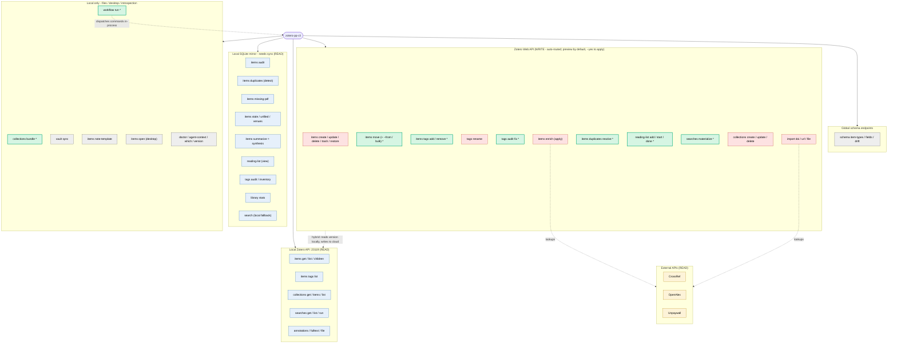

# zotero-pp-cli — feature map

Grouping = backend / data routing. **`*` = added or changed in the write-safety platform work.**
Core architecture: **reads stay local; writes auto-route to the Zotero Web API** (hybrid routing —
the version read happens locally, the write goes to the cloud, and only with an `api_key`).

## Legend

| Group | Backend | Direction |
|---|---|---|
| **Local SQLite mirror** | synced `data.db` (`sync` first) | read |
| **Local Zotero API** | `localhost:23119` desktop API (local-store fallback) | read |
| **Zotero Web API** | cloud — auto-routed for all mutations | **write** (preview → `--yes`) |
| **External APIs** | CrossRef / OpenAlex / Unpaywall (+ import services) | read |
| **Local only** | files, desktop launch, in-process dispatch, introspection | local |
| **Global schema** | un-prefixed `/itemTypes` etc. | read |

Color coding: **green = new (`*`)**, **red = write**, **blue = read**, **yellow = external**, **grey = local-only**.

**Write-safety platform (`*` + the `WEB` group):** one mutation state machine (`apply = --yes && !--dry-run`,
`--dry-run` wins), split plan/result JSON envelope, write gates (`--max-changes` 500 / 50 under `--agent`,
`--allow-destructive` only for truly-irreversible ops), `--keys-from` bulk selection, fail-fast bulk, and
per-command MCP safety annotations. `--agent` no longer implies `--yes`.

**Validated by:** `gofmt` / `go build` / `go vet` / `go test` (unit tests over `httptest` mock Zotero + real local
SQLite), plus CLI smoke (registration, `workflow run` exit codes, `agent-context`/MCP mirror). **Not** validated
against a live Zotero Web API (offline; mocks only).
