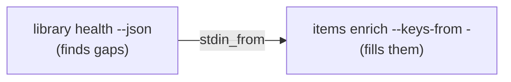

# Workflows & triggers

A **workflow** chains several `zotio` steps into one transactional run: one preview, one approval, one journal entry — with data flowing between steps, conditionals, and resume. It's the automation counterpart to [safe-by-default writes](../concepts/write-safety.md): the same preview-first, one-`--yes` contract, stretched from a single command to a whole plan.

Without a workflow: run five commands, approve five times, and hope you didn't skip one. With: one preview, one `--yes`, one reversible journal entry.

## What you'd use it for

**Fix every fixable gap in one reviewed pass.** Ask what's broken, then repair it — as a single operation you approve once:

```json
{ "steps": [
  { "name": "diagnose", "args": ["library", "health", "--json"] },
  { "name": "fix", "args": ["items", "enrich", "--keys-from", "-"], "stdin_from": "diagnose" }
]}
```
```bash
zotio workflow run fix-library.json          # see exactly what it would change
zotio workflow run fix-library.json --yes    # apply it all on one approval
```

`library health` finds the missing DOIs and metadata; its output pipes straight into `items enrich`. The preview shows the whole plan; one `--yes` runs it.

**Prove a bibliography is submission-ready.** Chain the checks that gate a paper so one command says pass or fail:

```json
{ "steps": [
  { "args": ["items", "bibcheck", "thesis.tex"] },
  { "args": ["export", "snapshot", "verify", "--fail-on-drift"] }
]}
```

**Keep the library tidy automatically.** Attach a hygiene workflow to the sync loop — it runs when the library changes and stays quiet when it doesn't:

```bash
zotio watch --workflow nightly-hygiene.json
```

!!! tip "Just one command?"
    Don't wrap it — run it directly. Workflows earn their keep when steps *feed each other* or must *apply together*.

## Preview, then apply

```bash
zotio workflow run workflow.json          # preview: mutating steps run --dry-run, read-only steps run for real
zotio workflow run workflow.json --yes    # apply the whole workflow on a single approval
```

Without `--yes`, every mutating step is forced to `--dry-run` while read-only steps run normally, so the plan reflects real data. A single `--yes` applies every step, and every mutation in the run shares one journal run ID:

```bash
zotio journal list --workflow <id>    # everything that run changed
zotio journal undo <run-id>           # reverse the reversible parts, as with any write
```

!!! note "Rules the runner enforces"
    - `--dry-run` always wins — even alongside `--yes`, the run previews.
    - The workflow owns approval: steps that embed their own `--yes`/`--dry-run` are rejected.
    - A `${...}` placeholder is *data* — it fills a flag's value but can't build a flag name or redirect a step to another command.

## How it works

A workflow is a JSON file: an optional `vars` map, an optional `continue_on_error`, and an ordered list of `steps`. Each step is a named `zotio` argument vector, optionally with `stdin_from` and `when`.

### Variables

Declare `vars` and reference them as `${vars.NAME}` in any step argument; override per run with repeatable `--var`:

```bash
zotio workflow run workflow.json --var PROJECT=demo
```

An undeclared `--var` name is rejected (a typo guard).

### Data flow between steps

A named step's output is addressable downstream:

- `${steps.NAME.output}` — the trimmed stdout of an earlier step, substituted into a later step's arguments.
- `"stdin_from": "NAME"` — pipe an earlier step's raw stdout into this step's stdin.



That is what makes *diagnose → fix* one workflow. Only stdout flows into data; stderr never does. In preview mode the substituted values are the *preview* outputs.

### Conditionals

Run a step only on an earlier step's outcome with `when`:

```json
{ "name": "notify", "args": ["...", "..."], "when": { "step": "fix", "is": "failed" } }
```

`is` is one of `ok`, `failed`, or `skipped`. By default a failed step stops the run; set `"continue_on_error": true` so the workflow proceeds and `when` branches (a cleanup or notify step) can react.

## Interrupted runs resume

An applied run records a checkpoint sidecar (`<spec>.checkpoint.json`) as it goes. If it's interrupted, continue where it stopped:

```bash
zotio workflow run workflow.json --yes --resume
```

Resume is spec-hash- and variable-verified: it refuses if the spec or the resolved `--var` set changed since the checkpoint, and a step whose completion is uncertain is **not** silently replayed. Re-running `--yes` while a checkpoint exists is refused — resume it, or delete the sidecar to start over. A successful run removes the sidecar.

## Triggers

Run a workflow automatically when the library changes by attaching it to the sync loop:

```bash
zotio watch --workflow workflow.json          # after every successful sync cycle
zotio tail  --workflow workflow.json          # once after a poll cycle that emitted change events
```

`watch --workflow` fires after each successful sync; `tail --workflow` fires only on cycles that saw events (quiet when nothing changed). Triggered runs follow the same contract: they **preview unless the `watch`/`tail` invocation itself carries `--yes`**. A trigger failure is logged but never stops the loop, and a failed *applied* trigger leaves its checkpoint — later applied triggers refuse until you resume or delete it (`zotio workflow run workflow.json --yes --resume`).

## From an agent — `workflow_submit`

Over MCP, an agent submits a workflow inline through the dedicated `workflow_submit` tool rather than the local-file `workflow run` runner (which stays CLI-only). Each submitted step names a mirrorable command and is validated against the **same per-command safe-flag allowlist as `command_run`**, then executed through the same transactional runner — previewing unless the submission sets `yes`. See the [MCP server guide](mcp-server.md) and the [MCP tools reference](../reference/mcp-tools.md).

## See also

- [Safe-by-default writes](../concepts/write-safety.md) — the mutation contract workflows extend.
- [Command reference › `zotio workflow`](../reference/commands.md) — every flag, generated from the binary.
